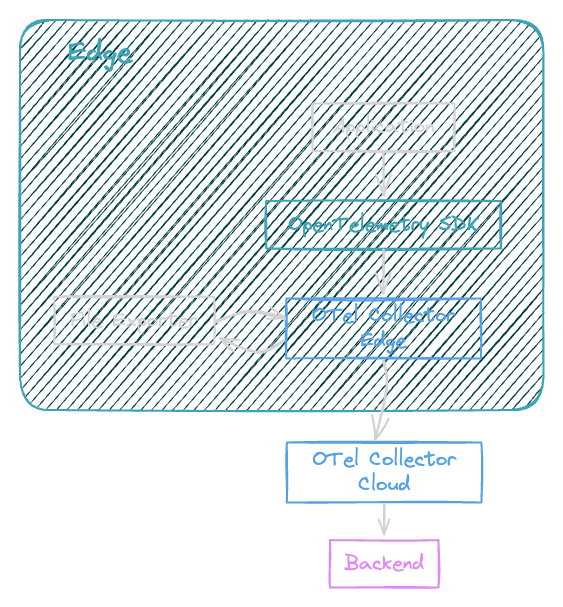
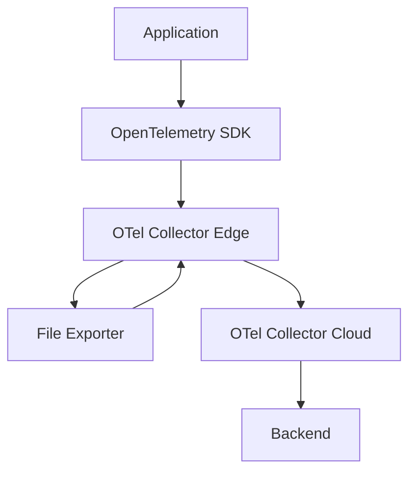

# Example - Dart with Flutter an OpenTelemetry

[](https://stand-with-ukraine.pp.ua)

This example shows how to use the OptenTelemetry with Dart and Flutter.

## Components

- [OpenTelemetry Collector](https://opentelemetry.io/docs/collector/)
- [Jaeger](https://www.jaegertracing.io/)
- [Flutter Exampe App](https://flutter.dev/)
- [Dart OpenTelemetry](https://pub.dev/packages/opentelemetry)

It starts a simple Flutter app that sends traces to the OpenTelemetry 
Collector, which then sends the traces to Jaeger. As a storage backend,
Jaeger uses Elasticsearch.

## Prerequisites

- [Docker](https://www.docker.com/)
- [Docker Compose](https://docs.docker.com/compose/)
- [Flutter](https://flutter.dev/)
- [Dart](https://dart.dev/)

## Features

- [x] Collect metrics from the Flutter app
- [x] Collect logs from the Flutter app
- [ ] Collect traces from the Flutter app
- [ ] Collect metrics with custom attributes from the Flutter app
- [ ] Offline capabilities to send traces to the OpenTelemetry Collector



---



## Documentation

### Extension - File Storage

[https://github.com/open-telemetry/opentelemetry-collector-contrib/tree/main/extension/storage/filestorage]

### Exporter Helper

[https://github.com/open-telemetry/opentelemetry-collector/tree/main/exporter/exporterhelper]

```text
                                                              ┌─Consumer #1─┐
                                                              │    ┌───┐    │
                              ──────Deleted──────        ┌───►│    │ 1 │    ├───► Success
        Waiting in channel    x           x     x        │    │    └───┘    │
        for consumer ───┐     x           x     x        │    │             │
                        │     x           x     x        │    └─────────────┘
                        ▼     x           x     x        │
┌─────────────────────────────────────────x─────x───┐    │    ┌─Consumer #2─┐
│                             x           x     x   │    │    │    ┌───┐    │
│     ┌───┐     ┌───┐ ┌───┐ ┌─x─┐ ┌───┐ ┌─x─┐ ┌─x─┐ │    │    │    │ 2 │    ├───► Permanent -> X
│ n+1 │ n │ ... │ 6 │ │ 5 │ │ 4 │ │ 3 │ │ 2 │ │ 1 │ ├────┼───►│    └───┘    │      failure
│     └───┘     └───┘ └───┘ └───┘ └───┘ └───┘ └───┘ │    │    │             │
│                                                   │    │    └─────────────┘
└───────────────────────────────────────────────────┘    │
   ▲              ▲     ▲           ▲                    │    ┌─Consumer #3─┐
   │              │     │           │                    │    │    ┌───┐    │
   │              │     │           │                    │    │    │ 3 │    ├───► (in progress)
 write          read    └─────┬─────┘                    ├───►│    └───┘    │
 index          index         │                          │    │             │
                              │                          │    └─────────────┘
                              │                          │
                          currently                      │    ┌─Consumer #4─┐
                          dispatched                     │    │    ┌───┐    │     Temporary
                                                         └───►│    │ 4 │    ├───►  failure
                                                              │    └───┘    │         │
                                                              │             │         │
                                                              └─────────────┘         │
                                                                     ▲                │
                                                                     └── Retry ───────┤
                                                                                      │
                                                                                      │
                                                   X  ◄────── Retry limit exceeded ───┘
```
