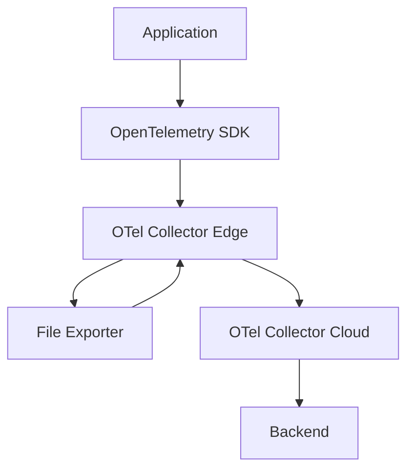

# Example - Dart with Flutter an OpenTelemetry

[](https://stand-with-ukraine.pp.ua)

This example shows how to use the OptenTelemetry with Dart and Flutter.

## Components

- [OpenTelemetry Collector](https://opentelemetry.io/docs/collector/)
- [Jaeger](https://www.jaegertracing.io/)
- [Flutter Exampe App](https://flutter.dev/)
- [Dart OpenTelemetry](https://pub.dev/packages/opentelemetry)

It starts a simple Flutter app that sends traces to the OpenTelemetry 
Collector, which then sends the traces to Jaeger. As a storage backend,
Jaeger uses Elasticsearch.

## Prerequisites

- [Docker](https://www.docker.com/)
- [Docker Compose](https://docs.docker.com/compose/)
- [Flutter](https://flutter.dev/)
- [Dart](https://dart.dev/)

## Features

- [x] Collect metrics from the Flutter app
- [x] Collect logs from the Flutter app
- [ ] Collect traces from the Flutter app
- [ ] Collect metrics with custom attributes from the Flutter app
- [ ] Offline capabilities to send traces to the OpenTelemetry Collector


---



## Documentation

### Queued retry

Die queued_retry Prozessor in OpenTelemetry Collector sorgt dafür, dass Daten, die nicht sofort an ihren Zielort gesendet werden können, in eine Warteschlange gestellt und später erneut gesendet werden. Dies ist besonders nützlich, wenn die Netzwerkverbindung instabil ist oder das Ziel vorübergehend nicht verfügbar ist. Hier ist eine detaillierte Erläuterung der Konfigurationselemente von queued_retry:

#### Konfigurationselemente von queued_retry

`retry_on_failure`: Diese Sektion definiert, wie der Prozessor mit Fehlern umgeht, die beim Senden von Daten auftreten.

`enabled`: Aktiviert oder deaktiviert die Wiederholungslogik. Wenn auf true gesetzt, wird der Prozessor versuchen, fehlgeschlagene Übertragungen erneut zu senden.
initial_interval: Gibt das anfängliche Intervall zwischen Wiederholungsversuchen an. Dies ist der Zeitraum, den der Prozessor wartet, bevor er den ersten Wiederholungsversuch unternimmt.
`max_interval`: Gibt das maximale Intervall zwischen Wiederholungsversuchen an. Wenn der initiale Intervall exponentiell wächst, wird er diesen Wert nicht überschreiten.
max_elapsed_time: Die maximale Zeitspanne, während der Wiederholungsversuche unternommen werden. Wenn diese Zeitspanne überschritten wird, werden keine weiteren Wiederholungsversuche unternommen.

`*`num_workers`: Die Anzahl der parallel arbeitenden Worker, die Wiederholungsversuche durchführen. Dies ermöglicht es, mehrere Wiederholungsversuche gleichzeitig zu handhaben.

`queue_size`: Die maximale Anzahl von Daten, die in die Warteschlange gestellt werden können. Wenn diese Größe erreicht ist, werden keine weiteren Daten in die Warteschlange aufgenommen, bis einige Daten erfolgreich gesendet und aus der Warteschlange entfernt wurden.

#### Beispielkonfiguration

Hier ist ein Beispiel, wie queued_retry in der config.yaml Datei konfiguriert werden kann:

```yaml
processors:
  queued_retry:
    retry_on_failure:
      enabled: true
      initial_interval: 5s
      max_interval: 30s
      max_elapsed_time: 300s
    num_workers: 2
    queue_size: 5000
```

### Funktionsweise

1. Warteschlange: Wenn der Exporter fehlschlägt, Daten zu senden (z.B. wegen einer Netzwerkunterbrechung), werden die Daten in die Warteschlange gestellt.
2. Wiederholungsversuche: Der Prozessor versucht dann, die gescheiterten Übertragungen basierend auf den konfigurierten Intervallen (initial_interval, max_interval) erneut zu senden.
3. Begrenzte Zeit: Die Wiederholungsversuche werden fortgesetzt, bis entweder die Daten erfolgreich gesendet wurden oder die max_elapsed_time erreicht ist.
Parallelität: Die num_workers Einstellung bestimmt, wie viele Wiederholungsversuche parallel durchgeführt werden können, was die Effizienz erhöht, insbesondere bei großen Datenmengen oder häufigen Fehlern.
4. Warteschlangengröße: Die queue_size Begrenzung verhindert, dass die Warteschlange unendlich wächst und zu Speicherproblemen führt. Wenn die Warteschlange voll ist, werden keine neuen Daten akzeptiert, bis Platz geschaffen wird.
5. Die queued_retry Prozessor ist somit eine wichtige Komponente, um die Zuverlässigkeit der Datenübertragung zu erhöhen und sicherzustellen, dass keine Daten verloren gehen, selbst wenn es zu vorübergehenden Netzwerkproblemen kommt.
